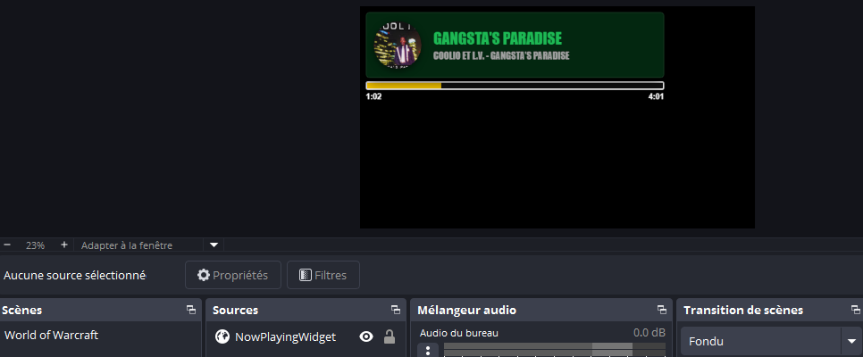
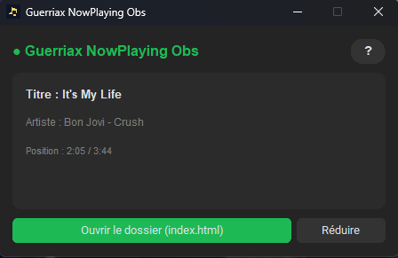
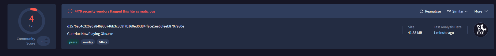
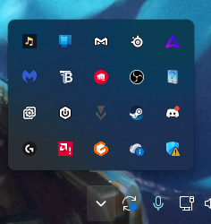

# 🎵 Guerriax NowPlaying Obs

### Affiche en direct la musique que tu écoutes sur ton stream OBS.
**Simple. Gratuit. Sans compte, sans connexion, sans prise de tête.**

-1db954?style=for-the-badge)

---

## ✨ C'est quoi ?

**Guerriax NowPlaying Obs** est un petit logiciel pour Windows qui détecte la musique que tu écoutes et l'affiche dans un **widget stylé** sur ton stream ou ta vidéo OBS.

Le widget affiche :

- 💿 la **pochette** de l'album (en rond)
- 🎤 le **titre** et l'**artiste**
- ⏱️ le **temps écoulé** et la **durée totale**
- 📊 une **barre de progression** en direct

Quand tu changes de musique, le widget se met à jour **tout seul**. Tu n'as rien à faire.

> 💡 **Pas besoin de savoir coder !** Tu télécharges, tu lances, tu ajoutes dans OBS. C'est tout.

---

## 📥 Installation

1. Va dans l'onglet [**Releases**](https://github.com/Guerriax/Guerriax-NowPlaying-Obs/releases) de ce dépôt.
2. Télécharge le fichier **`Guerriax NowPlaying Obs.exe`**.
3. **Place-le dans son propre dossier** (par exemple `C:\Stream\NowPlaying\`).
   > ⚠️ Important : le logiciel crée ses fichiers à côté du `.exe`, un dossier dédié évite de tout mélanger.
4. Double-clique sur le `.exe` pour le lancer.

**Aucune installation requise.** Pas de Python, pas de dépendances : tout est dans le `.exe`.

 <i>La fenêtre du logiciel : tu y vois en direct la musique détectée.</i>

### 🛡️ Windows affiche un avertissement ?

C'est normal pour les petits logiciels indépendants qui ne sont pas signés.
Clique sur **« Informations complémentaires »** puis **« Exécuter quand même »**.

---

## 🔒 Est-ce que c'est sûr ?

Oui, et tu peux le vérifier toi-même. Le fichier a été analysé par **VirusTotal**, qui le passe au crible avec des dizaines d'antivirus.

 

👉 [**Voir le rapport VirusTotal complet**]([LIEN_VIRUSTOTAL](https://www.virustotal.com/gui/file/d1576a04c32696a846930746b3c309f7b160ed0d84ff9ce1ee66feeb8707980e/detection))

> ℹ️ Il arrive qu'un antivirus signale à tort ce type de logiciel (on appelle ça un *faux positif*), c'est courant avec les programmes créés avec PyInstaller. Le logiciel ne se connecte à aucun serveur : il lit simplement l'information de lecture de ton PC et écrit quelques petits fichiers à côté de lui.

---

## 🎬 Ajouter le widget dans OBS Studio

1. **Lance d'abord** Guerriax NowPlaying Obs (le fichier `index.html` est créé au démarrage).
2. Dans OBS, dans la zone **Sources**, clique sur **➕** puis choisis **Navigateur** (*Browser*).
3. Donne-lui un nom, par exemple `NowPlayingWidget`, puis valide.
4. Coche la case **« Fichier local »**.
5. Clique sur **Parcourir** et sélectionne le fichier **`index.html`** qui se trouve **à côté du `.exe`**.
   > 💡 Astuce : dans le logiciel, le bouton **« Ouvrir le dossier (index.html) »** t'y amène directement.
6. Règle la taille de la source : **largeur `520`**, **hauteur `180`** fonctionne bien.
7. Clique sur **OK**. Ton widget apparaît ! 🎉
8. Place-le où tu veux sur ta scène avec la souris. Tu peux aussi le redimensionner avec **ALT + clic gauche** sur les bords.

Le bouton **`?`** dans le logiciel te rappelle ces étapes à tout moment.

---

## 🎧 Quelles applications sont compatibles ?

Le logiciel récupère les infos **directement depuis Windows**, comme le petit panneau de contrôle média que tu vois quand tu changes le volume. Donc ça fonctionne avec tout ce qui s'y affiche, par exemple :

- 🌐 Les lecteurs dans ton **navigateur** (YouTube, YouTube Music, Deezer, SoundCloud, Twitch…) sur Chrome, Edge, Firefox…
- 🎵 Apple Music, Deezer (application), Amazon Music, TIDAL, et la plupart des lecteurs audio modernes

### 🚫 Applications ignorées volontairement

Dans cette version, ces applications sont **ignorées** :

`Spotify` · `VLC` · `Windows Media Player` · `Discord` · `Groove`

Si l'une d'elles est la source média active de Windows, le widget affichera « N/A ».

> 💬 Tu aimerais qu'une application en particulier soit compatible ? Dis-le moi dans une [Issue](https://github.com/Guerriax/Guerriax-NowPlaying-Obs/issues) !

---

## 🖥️ Utiliser le logiciel

| Bouton | À quoi ça sert |
|---|---|
| **Ouvrir le dossier (index.html)** | Ouvre l'explorateur Windows sur le fichier à ajouter dans OBS |
| **Réduire** | Cache la fenêtre dans la **zone de notification** (à côté de l'horloge) sans arrêter le widget |
| **`?`** | Affiche l'aide de configuration OBS |
| **❌ (fermer la fenêtre)** | **Quitte complètement** le logiciel |

> ⚠️ **Le logiciel doit rester ouvert pendant ton stream.** Si tu le fermes, le widget n'est plus mis à jour (utilise **Réduire** pour le garder en arrière-plan).

### 📌 Retrouver le logiciel après l'avoir réduit

Une fois réduit, le logiciel se cache près de l'horloge Windows. Clique sur la petite flèche **˄** pour afficher les icônes cachées : tu y verras l'icône du logiciel (la petite note de musique). Clique dessus, ou fais un clic droit → **Afficher**, pour rouvrir la fenêtre. Tu peux aussi faire clic droit → **Quitter** pour l'arrêter.

---

## 🧹 Fichiers créés (et nettoyage automatique)

Pendant qu'il tourne, le logiciel crée à côté du `.exe` quelques petits fichiers (`index.html`, des `.txt` et un dossier `images`). Ils servent à alimenter le widget.

**À la fermeture du logiciel, tout est supprimé automatiquement.** Ton dossier reste propre.

---

## ❓ Problèmes fréquents

<b>Le widget est vide ou affiche « N/A »</b>

- Vérifie qu'une musique est **en cours de lecture**.
- Vérifie que l'application n'est pas dans la liste des applications ignorées (voir plus haut).
- Ouvre le panneau de volume Windows ou appuie sur une touche **média** de ton clavier : si ta musique n'y apparaît pas, le logiciel ne pourra pas la voir non plus.

<b>OBS n'affiche rien / la source est transparente</b>

- Vérifie que **le logiciel est bien lancé**.
- Dans les propriétés de la source Navigateur, clique sur **« Actualiser le cache de la page actuelle »**.
- Si tu as déplacé le `.exe` depuis l'ajout dans OBS, resélectionne le nouveau `index.html`.

<b>La pochette ne s'affiche pas</b>

Certains lecteurs ne fournissent pas d'image à Windows. Dans ce cas, une image par défaut est utilisée.

<b>Le titre est trop long</b>

Pas de souci : le texte se **réduit automatiquement** pour toujours rentrer dans le widget.

---

## 🗺️ À propos de cette version

**Version 1 (Free)** : la version gratuite, avec tout le nécessaire pour afficher ta musique sur OBS.

Une idée, un bug, une suggestion ou envie de voir une application en particulier devenir compatible ? Ouvre une [Issue](https://github.com/Guerriax/Guerriax-NowPlaying-Obs/issues) sur ce dépôt, je la lirai avec plaisir.

---

## 📜 Licence

Logiciel **gratuit**, mais **non open source**. Tu peux l'utiliser librement (même sur une chaîne monétisée) et le partager gratuitement tel quel. Il est interdit de le modifier, de le vendre ou de le faire passer pour le tien. Détails dans le fichier [LICENSE](LICENSE).

---

Fait avec 💚 par **Guerriax**

⭐ Si le logiciel te plaît, n'hésite pas à laisser une étoile sur le dépôt !

